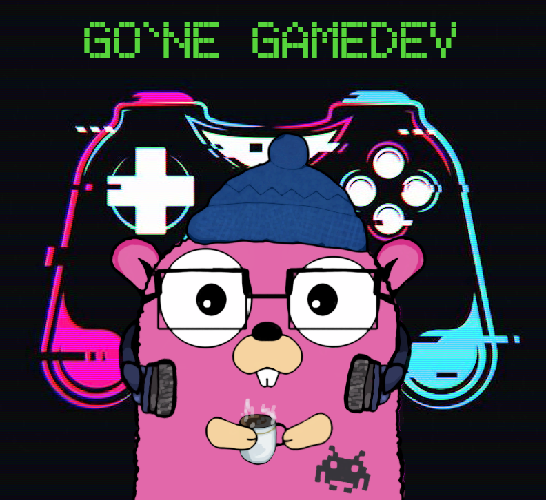

# GG Podcast

Русскоязычный подкаст о разработке игр на языке программирования [Go](https://go.dev/).

* Чатик в телеграме: [t.me/go_gamedev](https://t.me/go_gamedev)
* Канал с объявлениями подкаста: [t.me/gone_gamedev](https://t.me/gone_gamedev)

Сообщество разработки игр на Go - это место, где мы обсуждаем фреймворки и библиотеки, проекты, статьи и новости, связанные с созданием видеоигр. В подкасте мы немного выходим за эти рамки и сравниваем состояние геймдева на Go с Unity и другими популярными движками. 

## Выпуски подкаста

TODO
